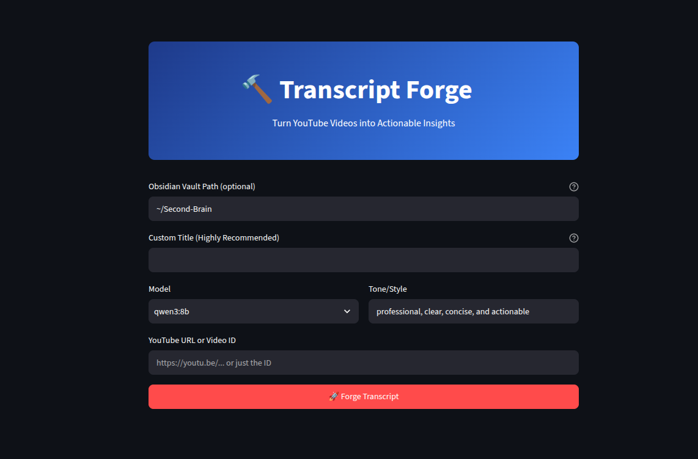
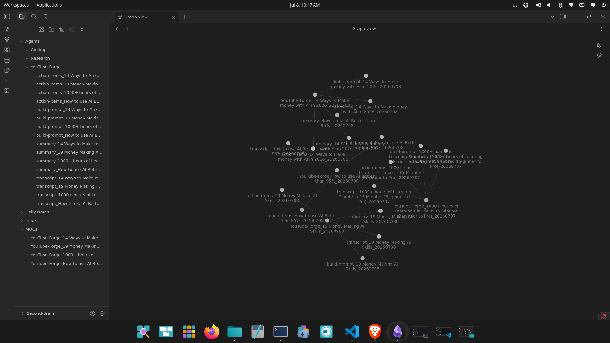

# Transcript Forge

**YouTube → Transcript → Summary → Action Items → Build Prompts**  
*A powerful local-first tool with Obsidian integration.*

Turn any YouTube video into clean markdown outputs: full transcripts, concise summaries, key action items, and ready-to-use AI coding/build prompts. Fully private — nothing leaves your machine.



## ✨ Features

- **Any YouTube video** (short or long — auto-chunking for >20min)
- **Local LLMs** via Ollama (custom model + tone)
- **Obsidian integration**: Auto-saves notes + updates index in `MOCs/` (frontmatter support)
- **ZIP download** + individual files
- **Streamlit UI** — clean, fast, and user-friendly
- Custom title override

## Quick Start

1. Clone the repo:
   ```bash
   git clone https://github.com/Virtuallaborer/transcript-forge.git
   cd transcript-forge
   ```

2. Install dependencies:
   ```bash
   conda create -n transcript-forge python=3.12 -y
   conda activate transcript-forge
   pip install -r requirements.txt
   ```

3. Ensure **Ollama** is running locally with a model (e.g. `ollama pull qwen3:8b` or `llama3.2`).

4. Run the app:
   ```bash
   streamlit run transcript_forge.py
   ```

5. Paste a YouTube URL/ID → **Forge Transcript** → Enjoy outputs + Obsidian sync!

## Requirements

- Python 3.12+
- [Ollama](https://ollama.com) running locally
- Recommended models: `qwen3:8b`, `llama3.2`, `deepseek-coder-v2`

See `requirements.txt` for Python packages.

## Screenshots

(We'll update these in a later step with current UI + new features)

  
*Main interface with model/tone selection*

  
*Chunked processing + Obsidian save*

## Tech Stack

- `youtube-transcript-api`
- `ollama` (local inference)
- `streamlit`
- Obsidian vault integration

## Project Status

Functional + tested. Ready for daily use and sharing. Future: Multi-agent orchestration.

## Contributing

PRs welcome! Open issues for bugs, feature ideas, or Obsidian enhancements.

## License

MIT © [Virtuallaborer](https://github.com/Virtuallaborer)

---

**Built for solopreneurs, knowledge workers, and AI tinkerers.**